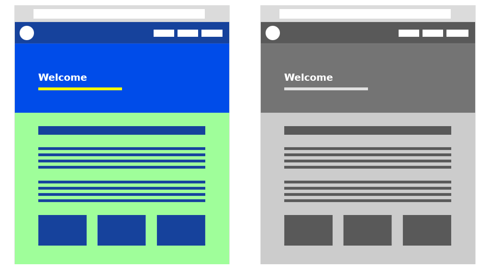

# Pensioner.js

*Convert CSS colors to grayscale*

[An explanation](https://tabreturn.github.io/code/html/javascript/2017/01/26/converting_css_colour_to_greyscale.html)
for the greyscale algorithms and approach used.

## to-do:

- [ ] gradient bg's
- [ ] images (backgrounds as well)
- [ ] box shadow & text shadow
